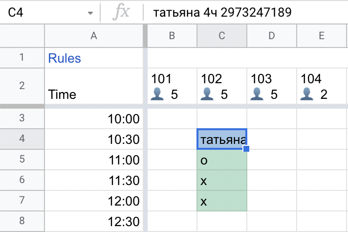

# Pygsheets cafe reservations

## Contents

1. [Overview](#overview)
    * [Before the spreadsheets](#before-the-spreadsheets)
    * [Goals](#goals)
    * [Result](#result)
2. [Spreadsheets](#spreadsheets)
    * [Data validation](#data-validation)
    * [Conditional formatting](#conditional-formatting)
    * [Automated creation](#automated-creation)
3. [Data analysis](#data-analysis)
4. [Further automation](#further-automation)
5. [Credits](#credits)

## Overview

### Before the spreadsheets
<p align = "center">

</p>
<p align = "center"> Fig 1. Administrator's notebook </p>
All the table reservations were written down arbitrarely in a notebook. 

### Goals

- [x] Validate each reservation data;
- [x] Speed up the free tables lookup;
- [x] Eliminate collisions and errors;
- [x] Enable the analysis of collected data.

### Result
[> Link to the demo Spreadsheet](https://docs.google.com/spreadsheets/d/1OybmGPD4qi9k0BlmHr1tee_5M1D3xCAftx32chKFNk0/edit?usp=sharing)
<p align = "center">

</p>
<p align = "center"> Fig 2. Reservations Google Spreadsheet </p>


## Spreadsheets

### Data validation

Consider the example:

<p align = "center">

</p>
<p align = "center"> Fig 3. Татьяна has booked the table 102 for 2 hours </p>

Each reservation is headed by a <b>GuestData</b> cell. This cell must comply with the following format:
<p align = "center">

</p>
<p align = "center"> {name} {persons} [чел|ч|Ч] {phone} {optional_comment}  </p>

In terms of a regular expression that would be:

<center>

`(.{2,}\s(\d+\sчел|\d+\s[чЧ]|\d+[чЧ])\s(\d{9}|\d{2}\s\d{7}))` 

</center>
<br>

The remaining reservation cells may contain only 1 character - <b>x</b> or <b>o</b>.
<b>X</b>'s are used to mark the duration: 1 cell = 30 min interval. 
And when a guest arrives, the topmost <b>x</b> is replaced with an <b>o</b> 
for the purpose of visibility - see [Conditional formatting](#conditional-formatting).

Reservation cells regex:

<center>

`[xoXOхоХО]{1}$`
</center>
<br>

The whole Google Sheet data validation formula is constructed as follows:

```python
this_cell = 'INDIRECT(ADDRESS(ROW(), COLUMN()))'
cell_above = 'INDIRECT(ADDRESS(ROW()-1, COLUMN()))'
guest_data = '(.{2,}\s(\d+\sчел|\d+\s[чЧ]|\d+[чЧ])\s(\d{9}|\d{2}\s\d{7}))'
duration_cell = '[xoXOхоХО]{1}$'

formula = f'=OR('\
            f'REGEXMATCH({this_cell}, "{guest_data}"), '\
            f'AND('\
                f'REGEXMATCH({cell_above}, "{duration_cell}|{guest_data}"), '\
                f'REGEXMATCH({this_cell}, "{duration_cell}")))'
```

### Conditional formatting

There are 3 formatting rules, ordered by their priopity descending:

- If a cell contains symbol "**o**", the cell above it is filled with blue - it helps the administrator to quickly distinguish between the guests who have or haven't arrived;

- If a **GuestData** cell contains comments (`"\d{7,}\s.{2,}"`) it is filed with yellow;

- All non-empty cells are filled with green color. 

### Automated creation

Spreadsheets for a whole year can be easily created in the [spreadsheet.ipynb](spreadsheet.ipynb) notebook:

```python
for m in range(1, 13):
    Spreadsheet(2022, m).create()
```


## Data analysis

The [analysis.ipynb](analysis.ipynb) notebook contains RawData and ProcessedData classes which help 
to retrieve the data from sheets and convert it to the following DataFrame:
<p align = "center">

</p>
<p align = "center"> Fig 4. Sample from the DataFrame (phone numbers are altered) </p>

This allows us to easily conduct studies and gain insights. For example, the vast majority of all reservations 
are made by women:
<p align = "center">

</p>
<p align = "center"> Fig 5. Gender distribution </p>


Studying the variance of the mean number of reservations across the week helped to optimise staff's shifts:
<p align = "center">

</p>
<p align = "center"> Fig 6. Reservations by times of day </p>


In october 2021 café's management decided to make it more accessable to visitors "from the street" by limiting the 
amount of reservations by 10 per day:
<p align = "center">

</p>
<p align = "center"> Fig 7. Reservations per month </p>

This measure has affected the table popularity, increasing the variance in shares of total reservations among 
all tables:
<p align = "center">

</p>
<p align = "center"> Fig 8. Share of all reservations by table </p>
The most desirable tables are always booked first, and since the daily limit was set their reservations commonly 
exhaust the quota.

## Further automation
Now that the reservations are digitized, the whole booking proccess may be delegated to a telegram chatbot.
Its major goals would be:
- [ ] Free up the administrator's time (≈ 2 hours every day). Although there are only 10 reservations available 
for each date, the number of incoming calls is significantly higher. Also, when a guest is being late
the administrator usually calls him to confirm that the reservation is still on.
- [ ] Allow for more reservations while increasing the walk-in availability. Obviously, the current 
daily quota is heuristic and can be replaced with a more advanced algorithm which would operate on a 
more precise time scale (hours instead of days), offer the alternative times to the guests, evenly distribute
the bookings between the tables and between the halls and concider the average loads.
- [ ] Establish a free, feature-rich and voluntary communication channel with guests, asking them to sign in for 
the cafe's newsletter.

## Credits
Used libraries:
- nithinmurali [pygsheets](https://github.com/nithinmurali/pygsheets)
- cphyc [matplotlib-label-lines](https://github.com/cphyc/matplotlib-label-lines)
- lead-ratings [gender-guesser](https://github.com/lead-ratings/gender-guesser)
- barseghyanartur [transliterate](https://github.com/barseghyanartur/transliterate)
- numpy, matplotlib, pandas - awesome as usual :)
